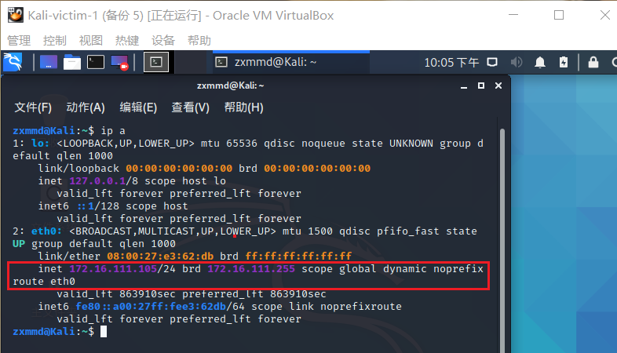
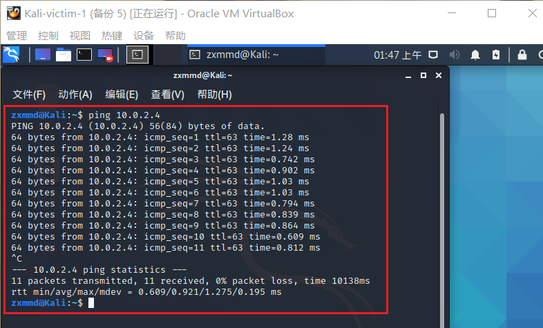
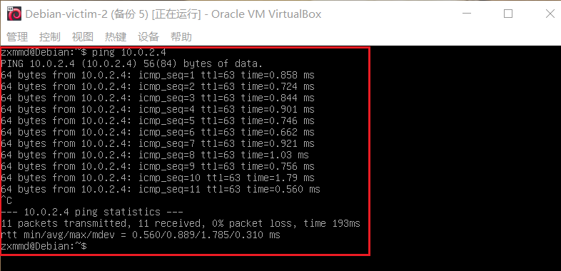
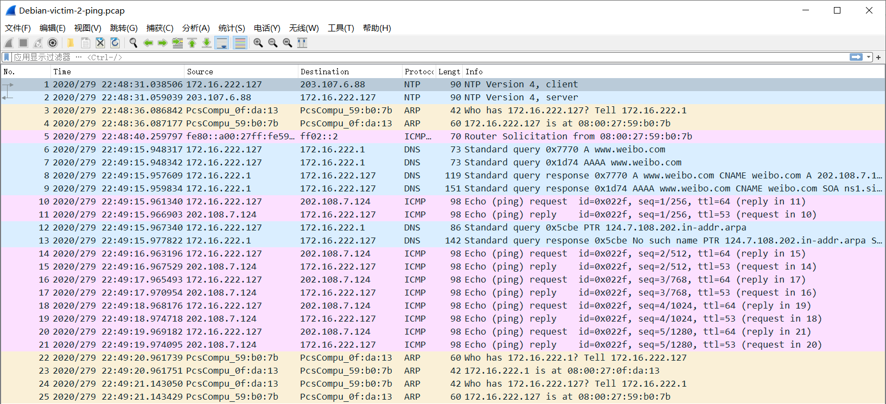
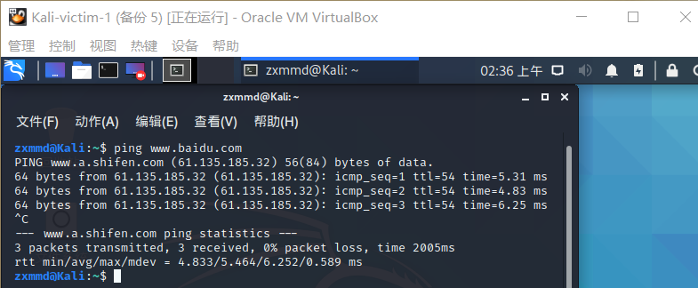
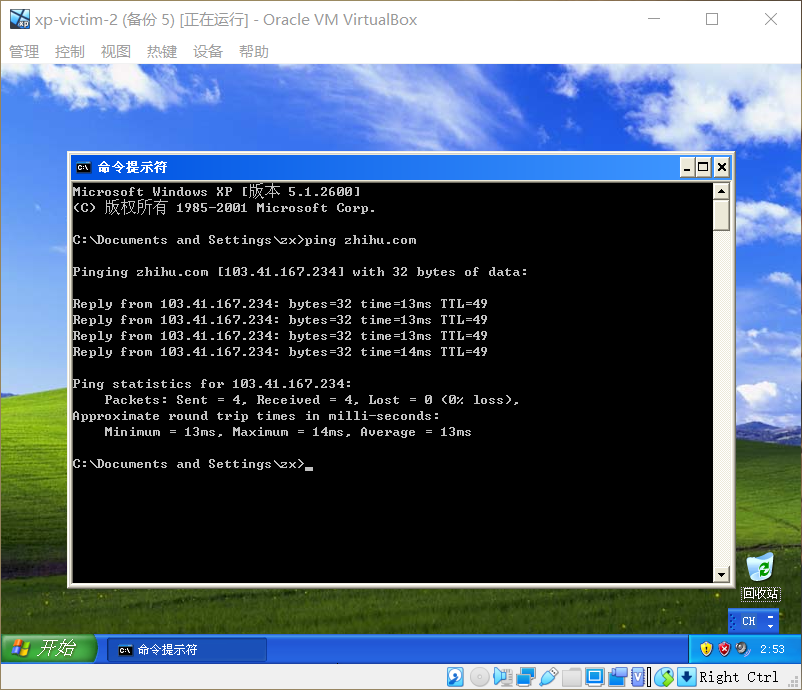

## 基于 VirtualBox 的网络攻防基础环境搭建

### 实验目的

- 掌握 VirtualBox 虚拟机的安装与使用
- 掌握 VirtualBox 的虚拟网络类型和按需配置
- 掌握 VirtualBox 的虚拟硬盘多重加载

### 实验环境

- VirtualBox 虚拟机
- 攻击者主机（Attacker）
  - Kali-Attacker

- 网关（Gateway, GW）
  - Debian-Gateway

- 靶机（Victim）
  - Kali-victim-1
 
  - xp-victim-1

  - Debian-victim-2

  - xp-victim-2


### 实验要求

- [x] 虚拟硬盘配置成多重加载

- [x] 搭建满足如下拓扑图所示的虚拟机网络拓扑

    

- [x] 完成以下网络连通性测试

  - 靶机可以直接访问攻击者主机

  - 攻击者主机无法直接访问靶机

  - 网关可以直接访问攻击者主机和靶机

  - 靶机的所有对外上下行流量必须经过网关

  - 所有节点均可以访问互联网

### 实验过程

#### 虚拟机配置

- 系统安装

  - 安装WindowsXP, Kali, Debian

  - 在虚拟介质管理中释放虚拟硬盘后，将系统映像改为多重加载

    

    

    

  - 使用多重加载的系统映像创建所需实验机

    
  
#### 网络配置

##### Debian-Gateway

- 选择网卡


```bash
# 编辑配置文件
vi /etc/network/interfaces
# 将原有内容删除，粘贴以下内容

# /etc/network/interfaces
# This file describes the network interfaces available on your system
# and how to activate them. For more information, see interfaces(5).

source /etc/network/interfaces.d/*

# The loopback network interface
auto lo
iface lo inet loopback

# The primary network interface
allow-hotplug enp0s3
iface enp0s3 inet dhcp
  post-up iptables -t nat -A POSTROUTING -s 172.16.111.0/24 ! -d 172.16.0.0/16 -o enp0s3 -j MASQUERADE
  post-up iptables -t nat -A POSTROUTING -s 172.16.222.0/24 ! -d 172.16.0.0/16 -o enp0s3 -j MASQUERADE
  
  post-up iptables -P FORWARD DROP
  post-up iptables -A FORWARD -m state --state RELATED,ESTABLISHED -j ACCEPT
  post-up iptables -A FORWARD -s '172.16.111.0/24' ! -d '172.16.0.0/16' -j ACCEPT
  post-up iptables -A FORWARD -s '172.16.222.0/24' ! -d '172.16.0.0/16' -j ACCEPT
  post-up iptables -I INPUT -s 172.16.111.0/24 -d 172.16.222.0/24 -j DROP
  post-up iptables -I INPUT -s 172.16.222.0/24 -d 172.16.111.0/24 -j DROP
  post-up echo 1 > /proc/sys/net/ipv4/ip_forward
  post-down echo 0 > /proc/sys/net/ipv4/ip_forward
  post-down iptables -t nat -F
  post-down iptables -F

allow-hotplug enp0s8
iface enp0s8 inet dhcp
allow-hotplug enp0s9

iface enp0s9 inet static
  address 172.16.111.1
  netmask 255.255.255.0

allow-hotplug enp0s10
iface enp0s10 inet static
  address 172.16.222.1
  netmask 255.255.255.0
```

```bash
# 使配置规则生效
/sbin/ifup enp0s9
/sbin/ifup enp0s10

# 重启主网卡
/sbin/ifdown enp0s3
/sbin/ifup enp0s3
```

```bash
# 安装dnsmasq
apt update && apt install dnsmasq

# 编辑配置文件
cd /etc/dnsmasq.d/

vi gw-enp0s9.conf
# 添加以下内容
  # /etc/dnsmasq.d/gw-enp09.conf
  interface=enp0s9
  dhcp-range=172.16.111.100,172.16.111.150,240h

vi gw-enp0s10.conf
# 添加以下内容
  # /etc/dnsmasq.d/gw-enp010.conf
  interface=enp0s10
  dhcp-range=172.16.222.100,172.16.222.150,240h

# 修改配置文件(做好备份)
vi /etc/dnsmasq.conf
  # 将 #log-queries 这一行取消注释
  # 在 log-queries 下面一行添加：
      log-facility=/var/log/dnsmasq.log

  # 将 #log-dhcp 这一行取消注释

# 重启dnsmasq
systemctl restart dnsmasq

# 将dnsmasq设置成开机启动
systemctl enable dnsmasq
```
- 配置结果
  - IP地址
  
  

  - 防火墙规则
  
  

##### Kali-victim-1

- 网卡


- IP地址从Debian-Gateway自动获取

 

##### xp-victim-1

- 网卡
  


- IP地址从Debian-Gateway自动获取


##### Debian-victim-2

- 网卡
  


- IP地址从Debian-Gateway自动获取


##### xp-victim-2

- 网卡
  


- IP地址从Debian-Gateway自动获取


##### Kali-Attacker

- 网卡
  


- IP地址


#### 连通性测试
  
##### 靶机可以直接访问攻击者主机

- intnet1

  - Kali-victim-1访问Kali-Attacker
      
  

  - xp-victim-1访问Kali-Attacker
      
  

- intnet2

  - Debian-victim-2访问Kali-Attacker
      
  

  - xp-victim-2访问Kali-Attacker
      
  

##### 攻击者主机无法直接访问靶机


##### 网关可以直接访问攻击者主机和靶机


##### 靶机的所有对外上下行流量必须经过网关

- 验证过程
```bash
# 在网关上安装tmux和tcpdump
sudo apt install tmux
sudo install tcpdump

# 抓包
sudo tcpdump -i enp0s9 -n -w Kali-victim-1.pcap
sudo tcpdump -i enp0s9 -n -w xp-victim-1.pcap
sudo tcpdump -i enp0s10 -n -w Debian-victim-1.pcap
sudo tcpdump -i enp0s10 -n -w xp-victim-2.pcap
 
# 下载到本地，用Wireshark分析
```
- 验证结果

  - Kali-victim-1

  

  - xp-victim-1

  

  - Debian-victim-2

  

  - xp-victim-2

  


##### 所有节点均可以访问互联网

- Kali-Gateway


- Kali-victim-1
      


- xp-victim-1


- Debian-victim-2


- xp-victim-2



### 遇到的问题

- 老师讲得太详细了，没遇到什么问题。多装了几次系统而已。

### 参考资料

- [第一章课后实验详解](https://www.bilibili.com/video/BV16t4y1i7rz?p=12)
