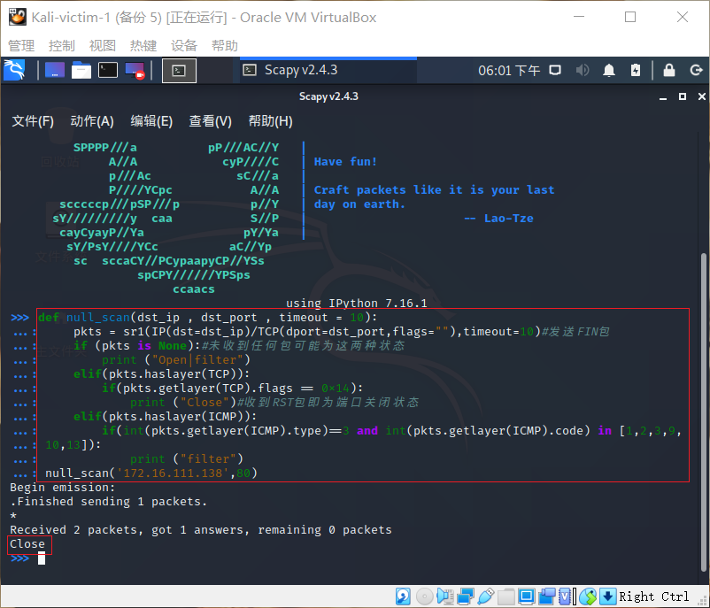

## 基于 Scapy 编写端口扫描器

### 实验目的

- 掌握网络扫描之端口状态探测的基本原理

### 实验环境

- python + [scapy](https://scapy.net/)

- 实验网络环境拓扑


### 实验要求

- [x] 禁止探测互联网上的 IP ，严格遵守网络安全相关法律法规

- [x] 完成以下扫描技术的编程实现

  - TCP connect scan / TCP stealth scan

  - TCP Xmas scan / TCP fin scan / TCP null scan

  - UDP scan

- [x] 上述每种扫描技术的实现测试均需要测试端口状态为：`开放`、`关闭` 和 `过滤` 状态时的程序执行结果
- [x] 提供每一次扫描测试的抓包结果并分析与课本中的扫描方法原理是否相符？如果不同，试分析原因
   - 相符
- [x] 在实验报告中详细说明实验网络环境拓扑、被测试 IP 的端口状态是如何模拟的
- [x] （可选）复刻 nmap 的上述扫描技术实现的命令行参数开关   
   - 每种扫描复刻了一种状态

### 实验过程

#### TCP connect scan

- 实验预期结果
  - 倘若攻击者向靶机发送SYN包，能完成三次握手，收到ACK,则端口为开发状态
  - 若只收到一个RST包，则端口为关闭状态
  - 倘若什么都没收到，则端口为过滤状态

- 基于scapy编写的代码
```
def tcpconnect_scan(dst_ip , dst_port , timeout = 10):
    pkts = sr1(IP(dst = dst_ip) / TCP(dport = dst_port , flags = "S") , timeout = timeout)#sr1()表示只接受一个包，此步在构造SYN包，flags="S"表示为SYN包
    if (pkts is None):
        print ("filter")
    elif (pkts.haslayer(TCP)):
        if (pkts[1].flags == 'AS'):#收到的第一个若为ACK包，则为开放状态
            print ("Open")
        elif (pkts[1].flags == 'AR'):#收到的第一个包为RST包，则为关闭状态
            print ("Close")
tcpconnect_scan('172.16.111.138',80) 
```

- 代码第一次执行的结果，显示端口为关闭 ，同时对抓包结果进行观察


- 将该端口`开启`后再执行代码（开启apache服务）,并同时进行抓包
```
systemctl start apache2
```


- 用nmap命令进行扫描，发现结果一致


- 在靶机(Kali-victim-2)中过滤80端口的tcp包,再执行代码。端口为过滤状态，抓包结果中只有一个接收到的TCP包
```
iptables -A INPUT -p tcp --dport 80 -j DROP
```


#### TCP stealth scan

- 基于scapy编写的代码
```
def tcpstealth_scan(dst_ip , dst_port , timeout = 10):
    pkts = sr1(IP(dst=dst_ip)/TCP(dport=dst_port,flags="S"),timeout=10)
    if (pkts is None):
        print ("filter")
    elif(pkts.haslayer(TCP)):
        if(pkts.getlayer(TCP).flags == 0x12):
            send_rst = sr(IP(dst=dst_ip)/TCP(dport=dst_port,flags="R"),timeout=10)
            print ("Open")
        elif (pkts.getlayer(TCP).flags == 0x14):
            print ("Close")
        elif(pkts.haslayer(ICMP)):
            if(int(pkts.getlayer(ICMP).type)==3 and int(stealth_scan_resp.getlayer(ICMP).code) in [1,2,3,9,10,13]):
                print ("Filtered")
tcpstealth_scan('172.16.111.138',80)
```

- 紧接着上面的实验,测试`过滤`状态


- 去掉过滤条件并开启80端口（此处开启apache服务）
```
systemctl start apache2
iptables -I INPUT -p tcp --dport 80 -j ACCPET
```


- 用nmap命令进行扫描，发现结果一致


- 把端口80关闭（此处停止apache服务）
```
systemctl stop apache2
```


#### TCP Xmas scan

- 这是一种隐蔽性扫描
   - 当端口处于关闭状态时，会回复一个RST包
   - 其余所有状态均无回复

- 基于scapy编写的代码
```
def Xmas_scan(dst_ip , dst_port , timeout = 10):
    pkts = sr1(IP(dst=dst_ip)/TCP(dport=dst_port,flags="FPU"),timeout=10)#发送FIN,PUSH,URG
    if (pkts is None):#未收到任何包可能为这两种状态
        print ("Open|filter")
    elif(pkts.haslayer(TCP)):
        if(pkts.getlayer(TCP).flags == 0x14):
            print ("Close")#收到RST包即为端口关闭状态
    elif(pkts.haslayer(ICMP)):
        if(int(pkts.getlayer(ICMP).type)==3 and int(pkts.getlayer(ICMP).code) in [1,2,3,9,10,13]):
            print ("Filtered")
Xmas_scan('172.16.111.138',80)
```

- 紧接着上面的实验,测试`关闭`状态


- 开启80端口（此处开启apache服务）,无响应
```
systemctl start apache2
```


- 用nmap命令进行扫描，发现结果一致


- 端口处于`过滤`状态，无响应
```
iptables -A INPUT -p tcp --dport 80 -j DROP
```


#### TCP FIN scan

- 仅发送FIN包
   - 收到RST包说明端口处于关闭状态
   - 无响应说明端口为开启/过滤状态

- 基于scapy编写的代码
```
def fin_scan(dst_ip , dst_port , timeout = 10):
    pkts = sr1(IP(dst=dst_ip)/TCP(dport=dst_port,flags="F"),timeout=10)#发送FIN包
    if (pkts is None):#未收到任何包可能为这两种状态
        print ("Open|filter")
    elif(pkts.haslayer(TCP)):
        if(pkts.getlayer(TCP).flags == 0x14):
            print ("Close")#收到RST包即为端口关闭状态
    elif(pkts.haslayer(ICMP)):
        if(int(pkts.getlayer(ICMP).type)==3 and int(pkts.getlayer(ICMP).code) in [1,2,3,9,10,13]):
            print ("filter")
fin_scan('172.16.111.138',80)
```

- 紧接着上面的实验,测试`过滤`状态


- 去掉过滤条件并开启80端口（此处开启apache服务）,未收到回应包
```
systemctl start apache2
iptables -I INPUT -p tcp --dport 80 -j ACCPET
```


- 用nmap命令进行扫描，发现结果一致


- 把端口80关闭（此处停止apache服务）,收到RST包
```
systemctl stop apache2
```


#### TCP null scan

- 发送的包中关闭所有TCP报⽂头标记
   - 收到RST包说明端口处于关闭状态
   - 无回应包说明端口为开启/过滤状态

- 基于scapy编写的代码
```
def null_scan(dst_ip , dst_port , timeout = 10):
    pkts = sr1(IP(dst=dst_ip)/TCP(dport=dst_port,flags=""),timeout=10)#发送FIN包
    if (pkts is None):#未收到任何包可能为这两种状态
        print ("Open|filter")
    elif(pkts.haslayer(TCP)):
        if(pkts.getlayer(TCP).flags == 0x14):
            print ("Close")#收到RST包即为端口关闭状态
    elif(pkts.haslayer(ICMP)):
        if(int(pkts.getlayer(ICMP).type)==3 and int(pkts.getlayer(ICMP).code) in [1,2,3,9,10,13]):
            print ("filter")
null_scan('172.16.111.138',80)
```

- 紧接着上面的实验,测试`关闭`状态,收到RST包




- 端口为`开启`状态,无响应


- 用nmap命令进行扫描，发现结果一致


- 端口为`过滤`状态,无响应


#### UDP scan

- 这是一种开放式扫描,通过发送UDP包进行扫描
   - 当收到UDP回复时,该端口为开启状态
   - 当无响应或收到其他拒绝反馈报文，可能为开放/被过滤

- 基于scapy编写的代码
```
def udp_scan(dst_ip,dst_port,dst_timeout = 10):
    #发送udp包
    udp_scan_resp = sr1(IP(dst=dst_ip)/UDP(dport=dst_port),timeout=dst_timeout)
    #未收到UDP回复则为Open/filter
    if (udp_scan_resp is None):
        print("Open|filter")
    #收到UDP回复则为开启状态
    elif (udp_scan_resp.haslayer(UDP)):
        print("Open")
    elif(udp_scan_resp.haslayer(ICMP)):
        if(int(udp_scan_resp.getlayer(ICMP).type)==3 and int(udp_scan_resp.getlayer(ICMP).code)==3):
            print("Close")
        elif(int(udp_scan_resp.getlayer(ICMP).type)==3 and int(udp_scan_resp.getlayer(ICMP).code) in [1,2,9,10,13]):
            print("filter")
        elif(udp_scan_resp.haslayer(IP) and udp_scan_resp.getlayer(IP).proto==IP_PROTOS.udp):
            print("Open")
udp_scan('172.16.111.138',53)
```

- 端口处于`关闭`状态下，可以看到ICMP包的type和code均为3,并且未收到UDP回复包


- `开启`UDP端口(此处开启dnsmasq服务),无响应
```
systemctl start dnsmasq
```


- 端口处于`过滤`状态,无响应
```
iptables -I INPUT -p udp --dport 53 -j DROP
```


- 用nmap命令进行扫描，发现结果一致


### 遇到的问题

- 无法使用`nc -l -u -p 53 < /etc/passwd `"打开"UDP端口
   - 通过开启dnsmasq"打开"UDP端口

### 参考

- [2019-NS-Public-chencwx](https://github.com/CUCCS/2019-NS-Public-chencwx/tree/ns_chap0x05/ns_chapter5)
- [cuc-ns-ppt 第五章](https://c4pr1c3.github.io/cuc-ns-ppt/chap0x05.md.html#/title-slide)
