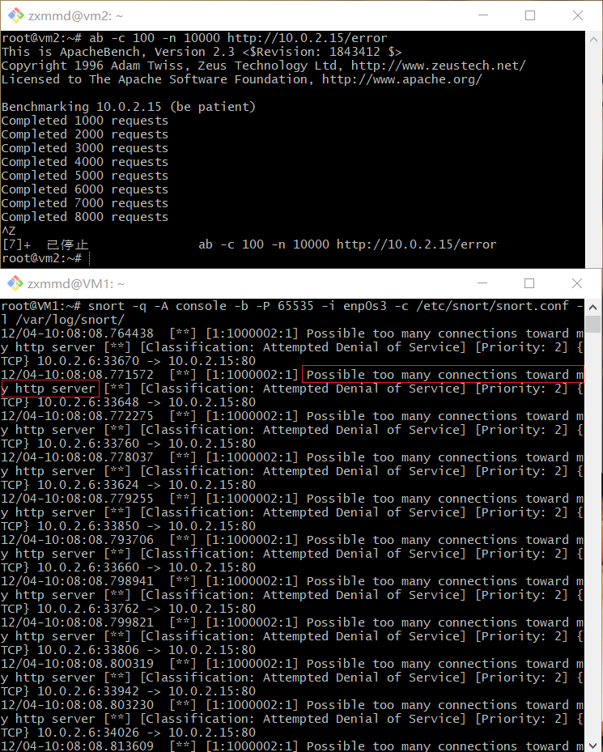
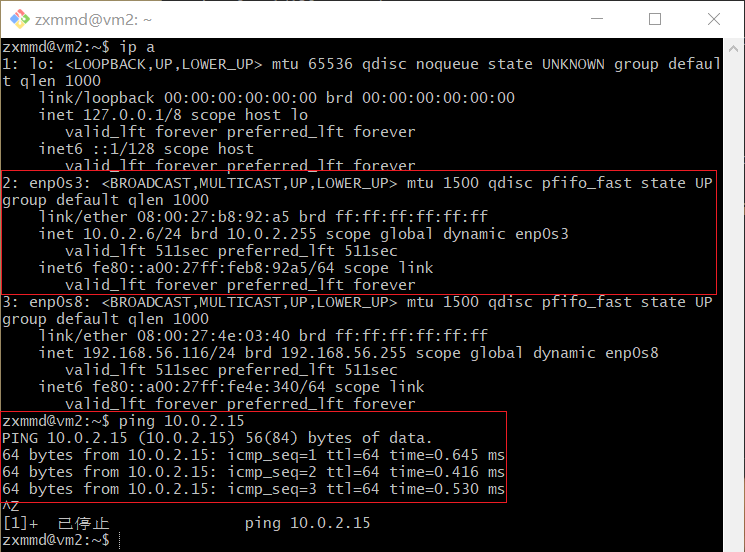

## 入侵检测

### 实验目的

+ 进行入侵检测的软件实现体验

### 实验要求

+ 通过配置snort不同规则来进行网络入侵检测

### 实验环境

+ 两台debian主机，可互通
  - root@VM1 : 10.0.2.15
  - root@vm2 : 10.0.2.6
+ 工具：snort

### 实验过程

#### 配置snort为嗅探模式

+ 安装snort

  ```bash
  apt install snort
  ```

+ 配置snort为嗅探模式

  ```bash
  # 显示IP/TCP/UDP/ICMP头
  snort –v
  ```

  

  ```bash
  # 显示应用层数据
  snort -vd
  ```

  

  ```bash
  # 显示数据链路层报文头
  snort -vde
  ```

  

  ```bash
  # -b 参数表示报文存储格式为 tcpdump 格式文件
  # -q 静默操作，不显示版本欢迎信息和初始化信息
  snort -q -v -b -i enp0s3 "port not 22"
  
  # 使用 CTRL-C 退出嗅探模式
  # 嗅探到的数据包会保存在 /var/log/snort/snort.log.<epoch timestamp>
  # 其中<epoch timestamp>为抓包开始时间的UNIX Epoch Time格式串
  # 可以通过命令 date -d @<epoch timestamp> 转换时间为人类可读格式
  # exampel: date -d @1511870195 转换时间为人类可读格式
  # 上述命令用tshark等价实现如下：
  tshark -i enp0s3 -f "port not 22" -w 1_tshark.pcap
  ```

  

--- 

#### 配置并启用snort内置规则

+ 基本知识

  ```bash
  # /etc/snort/snort.conf 中的 HOME_NET 和 EXTERNAL_NET 需要正确定义
  # 例如，学习实验目的，可以将上述两个变量值均设置为 any
  snort -q -A console -b -i enp0s3 -c /etc/snort/snort.conf -l /var/log/snort/
  ```
  
+ 将其中的`HOME_NET`和`EXTERNAL_NET`设置为`any`

  

+ 启用内置规则

  ```bash
  snort -q -A console -b -i eth0 -c /etc/snort/snort.conf -l /var/log/snort/
  ```

  

---

#### 自定义snort规则

+ 新建snort规则文件

  ```bash
  # 新建自定义 snort 规则文件
  cat << EOF > /etc/snort/rules/cnss.rules
  alert tcp $EXTERNAL_NET any -> $HTTP_SERVERS 80 (msg:"Access Violation has been detected on /etc/passwd ";flags: A+; content:"/etc/passwd"; nocase;sid:1000001; rev:1;)
  alert tcp $EXTERNAL_NET any -> $HTTP_SERVERS 80 (msg:"Possible too many connections toward my http server"; threshold:type threshold, track by_src, count 100, seconds 2; classtype:attempted-dos; sid:1000002; rev:1;)
  EOF
  ```

  

+ 添加新的配置到原始配置文件

  ```bash
  # 添加配置代码到 /etc/snort/snort.conf
  include $RULE_PATH/cnss.rules
  ```

+ 启用新的配置

  ```bash
  snort -q -A fast -b -i enp0s3 -c /etc/snort/snort.conf -l /var/log/snort/
  ```

+ 发现靶机发出了警报，可见配置生效

  

---

#### 和防火墙联动

+ 连通性测试

  

  

+ 下载并解压缩[Guardian-1.7.tar.gz](https://c4pr1c3.github.io/cuc-ns/chap0x09/attach/guardian.tar.gz)  

  ```bash
  # 下载压缩包
  wget https://c4pr1c3.github.io/cuc-ns/chap0x09/attach/guardian.tar.gz

  # 解压缩 Guardian-1.7.tar.gz
  tar zxf guardian.tar.gz
  
  # 安装 Guardian 的依赖 lib
  apt install libperl4-corelibs-perl
  ```

  

  

+ 在靶机上先后开启 `snort` 和 `guardian.pl` 

  ```bash
  # 开启 snort
  snort -q -A fast -b -i eth1 -c /etc/snort/snort.conf -l /var/log/snort/
  ```

+  编辑 guardian.conf 并保存，确认以下2个参数的配置符合主机的实际环境参数。 并启动

  ```bash
  HostIpAddr      10.0.2.15
  Interface       enp0s3
  # 启动 guardian.pl
  perl guardian.pl -c guardian.conf
  ```

  

+ 开启guardian.pl

  ```bash
  # 启动 guardian.pl
  perl guardian.pl -c guardian.conf
  ```

+ 在攻击者上对靶机进行nmap暴力扫描

  ```bash
  nmap 10.0.2.15 -A -T4 -n -vv
  ```

+ 查看此时guardian的状态

  

+ 查看防火墙规则，guardian.conf 中默认的来源IP被屏蔽时间是 60 秒，在一分钟之后会更新iptable的规则会被删除

+ 理论上的结果
  
  ```bash
  root@VM1:~# iptables -L -n
  Chain INPUT (policy ACCEPT)
  target     prot opt source               destination
  REJECT     tcp  --  10.0.2.6             0.0.0.0/0            reject-with tcp-reset
  DROP       all  --  10.0.2.6             0.0.0.0/0
  
  Chain FORWARD (policy ACCEPT)
  target     prot opt source               destination
  
  Chain OUTPUT (policy ACCEPT)
  target     prot opt source               destination
  # 1分钟后，guardian.pl 会删除刚才添加的2条 iptables 规则
  root@VM1:~# iptables -L -n
  Chain INPUT (policy ACCEPT)
  target     prot opt source               destination
  
  Chain FORWARD (policy ACCEPT)
  target     prot opt source               destination
  
  Chain OUTPUT (policy ACCEPT)
  target     prot opt source               destination
  ```

+ 实际结果

  

+ 由上可知，在攻击者暴力扫描过程中，靶机上的 `iptables` 添加了拒绝和丢弃的规则，一段时间后，新添加的规则会被删除 

### 遇到的问题

+ `-bash:snort:未找到命令`
  - 使用`su -`切换到root用户

+ 使用debian系统进行实验时，要允许弹出交互式界面，并将`eth0`改为`enp0s3`

### 参考

+ [师姐作业](https://github.com/CUCCS/2018-NS-Public-jckling/blob/master/ns-0x09/IDS%26IPS%E5%AE%9E%E9%AA%8C%E6%8A%A5%E5%91%8A.md)
+ [课本第九章](https://c4pr1c3.github.io/cuc-ns/chap0x09/main.html)