## 应用程序安全加固

### 实验目的

+ 从web和ssh方面进行应用程序安全加固的体验

### 实验环境

+ 两台Kali系统虚拟机
  
   + Kali-Attacker : 10.0.2.7

   + Kali-Victim : 10.0.2.9

### 实验过程

#### Apache内置安全设施

+ 查看可用的模块并搜索需要的security模块

  ```bash
  ls -l /etc/apache2/mods-enabled/
  
  # 搜索security软件包
  apt search apache | grep security
  ```

  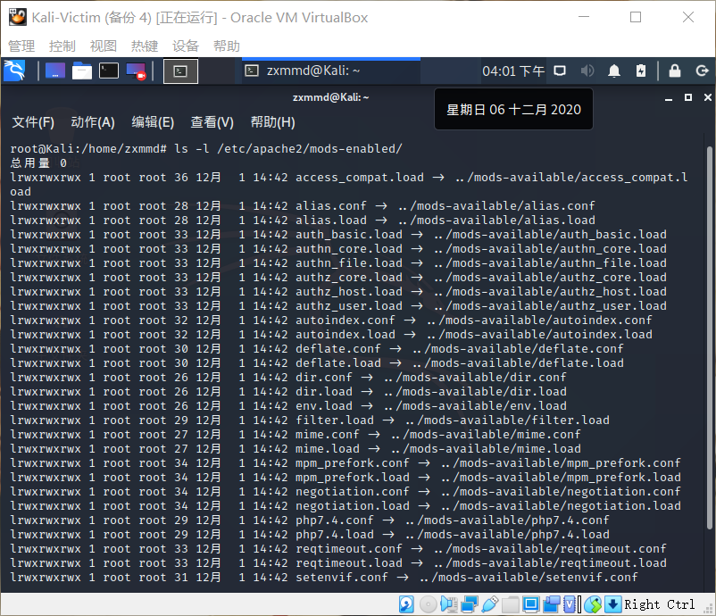

  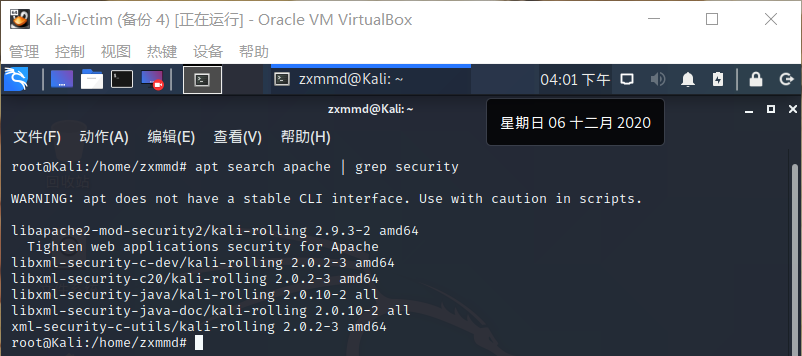

+ 安装相关模块

  ```bash
  apt update && apt-get install libapache2-mod-security2
  ```
  
  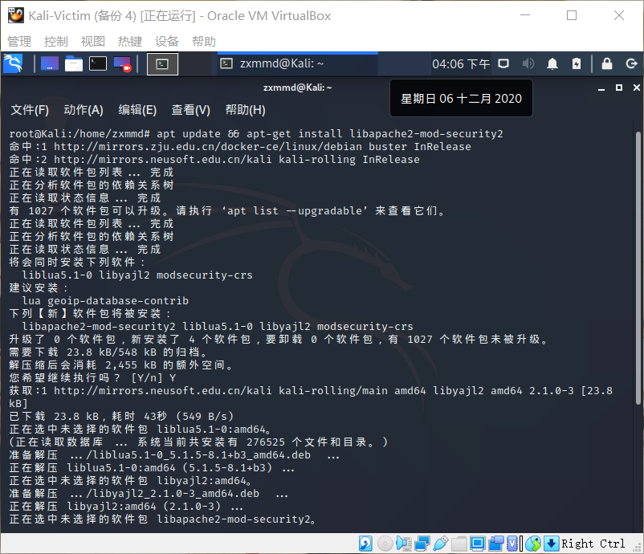
  
+ 查看下载的与security相关的包

  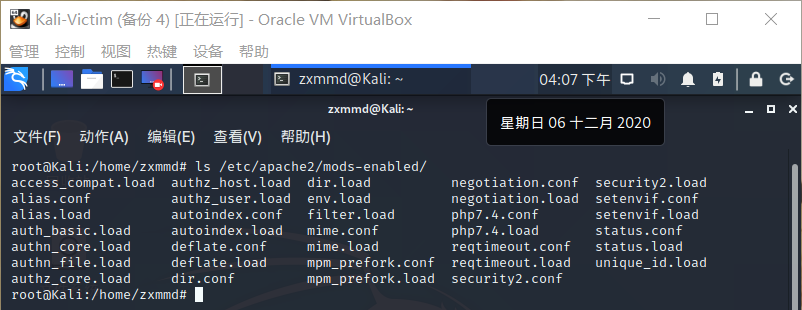

+ 配置规则

  ```bash
  # 备份规则
  mv /usr/share/modsecurity-crs /usr/share/modsecurity-crs.bk
  
  # 下载 OWASP ModSecurity Core Rule Set
  git clone https://github.com/SpiderLabs/owasp-modsecurity-crs.git /usr/share/modsecurity-crs
  
  # 到配置文件目录
  cd /usr/share/modsecurity-crs
  
  # 重命名
  mv crs-setup.conf.example crs-setup.conf
  
  # 修改配置
  vim /etc/apache2/mods-enabled/security2.conf
  
    # 在文件中添加规则路径
    <IfModule security2_module> 
         SecDataDir /var/cache/modsecurity 
         IncludeOptional /etc/modsecurity/*.conf 
         IncludeOptional /usr/share/modsecurity-crs/*.conf 
         IncludeOptional /usr/share/modsecurity-crs/rules/*.conf 
     </IfModule>
  
  # 启用引擎

  cd /etc/modsecurity
    # 重命名
    mv modsecurity.conf-recommended modsecurity.conf

    # 修改
    vim /etc/modsecurity/modsecurity.conf
  
      # 将 DectionOnly 改为 On
      SecRuleEngine On
  
  # 重启以生效
  systemctl restart apache2
  ```

  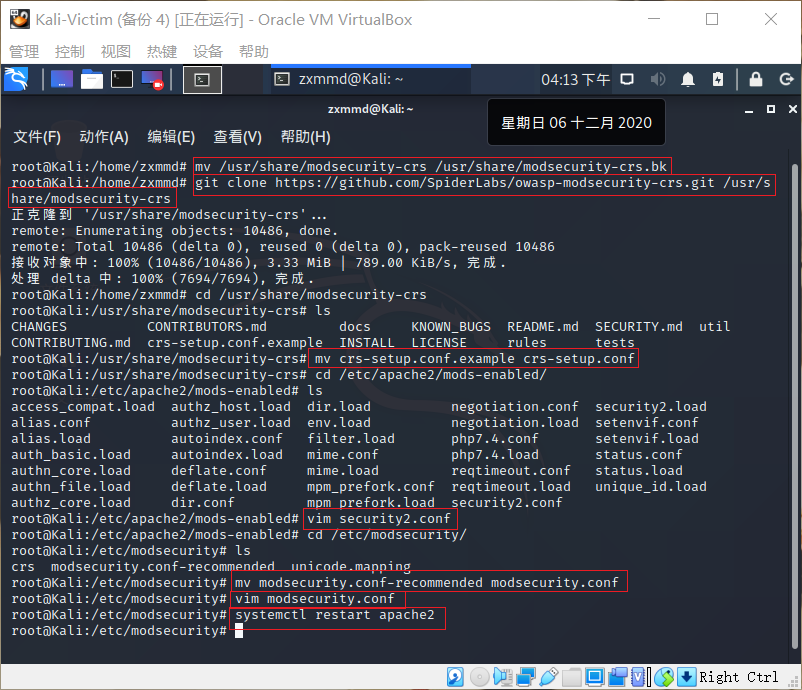
  
  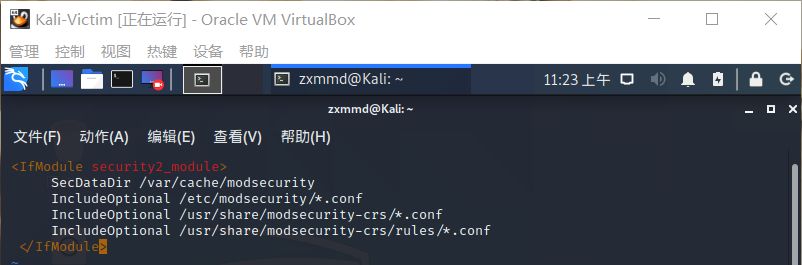

  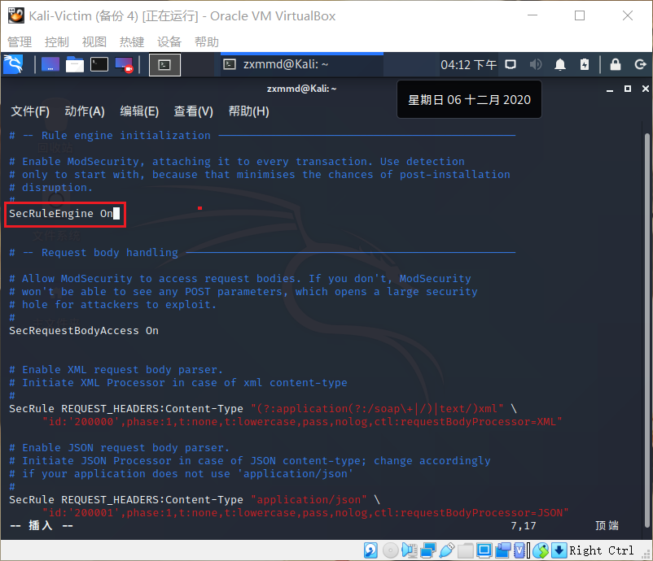
  
+ 让攻击者主机对靶机进行简单的xss攻击，使用`curl`指令进行测试，发现被拒绝
  
  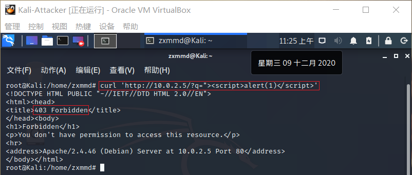
  
+ 查看日志文件，会发现该行为被记录了下来

  ```bash
  tail error.log
  ```

  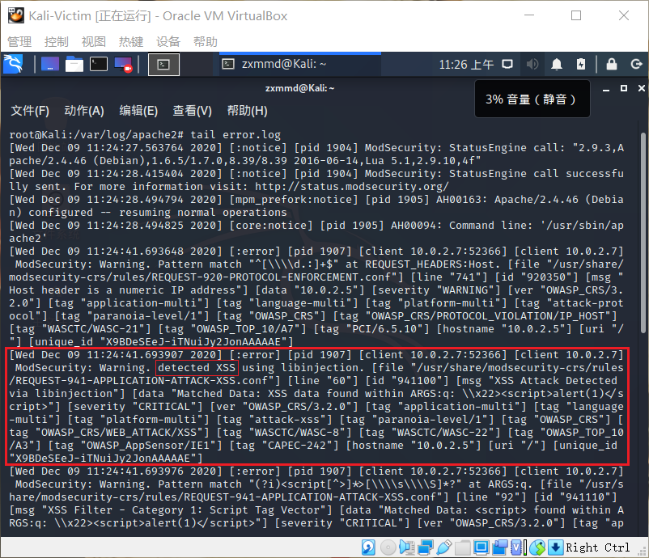

+ 这说明设置的规则生效了，可用预防一些owasp中的攻击并通过日志记录下来

#### 使用fail2ban防止ssh暴力破解

+ 配置ssh配置文件，允许以root权限ssh连接
  
  ```bash
  vi /etc/ssh/sshd_config
    # 在Authentication部分添加
    PermitRootLogin	yes		    

  # 重启ssh服务
  systemctl restart ssh
  ```
  
+ 解压爆破字典，使用字典进行爆破，几秒钟就成功了

  ```bash
  # 解压爆破字典
  gzip -d /usr/share/wordlists/rockyou.txt.gz
  
  # 类似的爆破工具还有：medusa/ncrack
  hydra -l root -P /usr/share/wordlists/rockyou.txt -v 192.168.56.101 ssh
  ```

  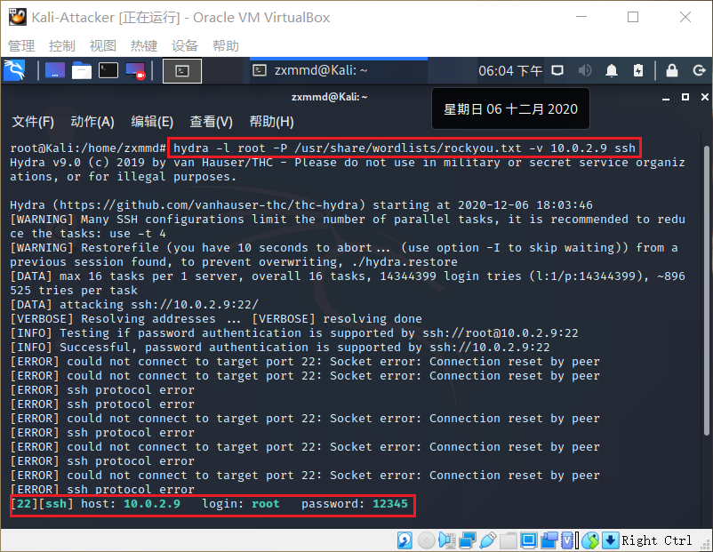

+ 安装fail2ban
  ```bash
  # 安装
  git clone https://github.com/fail2ban/fail2ban.git
  cd fail2ban
  sudo python setup.py install

  # 查看是否安装成功
  fail2ban-client -h

  # 启动 fail2ban
  fail2ban-client start

  # 查看预置的jail，可以在配置文件中看到对应的sshd.conf
  ls /etc/fail2ban/filter.d/
  ```
  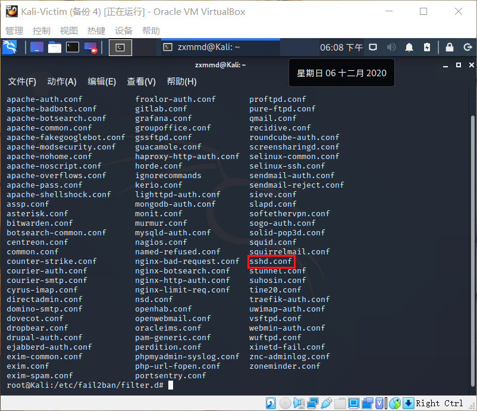

+ 进行自定义配置
  ```bash
  vim /etc/fail2ban/jail.local

  # 添加以下内容开启sshd jail
  [sshd]
  enabled = true

  ```

  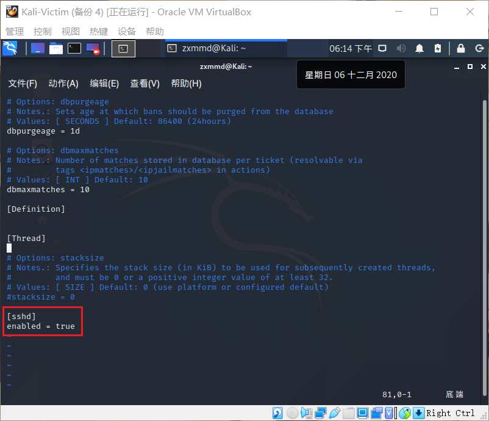
  
+ 启用 `sshd jail` 后，发现了被禁止的ip

  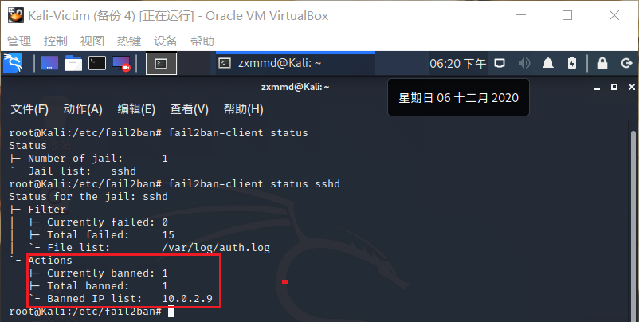

+ 在防火墙中也可以看到被禁止的ip，说明原理就是通过设置防火墙规则进行拒绝

  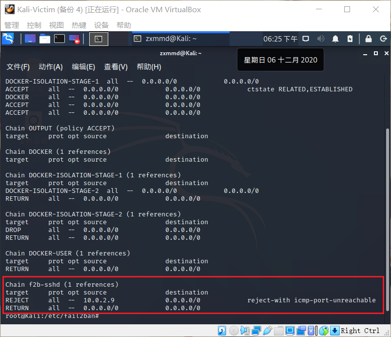

+ 当启用了`sshd jail` ，会去检查日志文件，攻击者爆破时留下了大量的日志信息，`sshd jail` 会根据定义的动作，将对应的IP加入黑名单

  ```bash
  # 查看日志，默认显示最后10行
  tail /var/log/fail2ban.log
  ```
  
  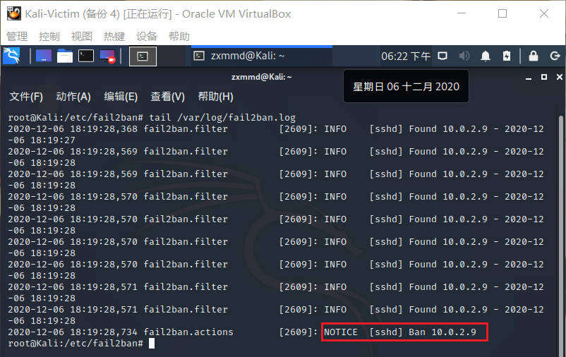

+ 说明fail2ban已经生效,在攻击者主机上测试，拒绝连接

  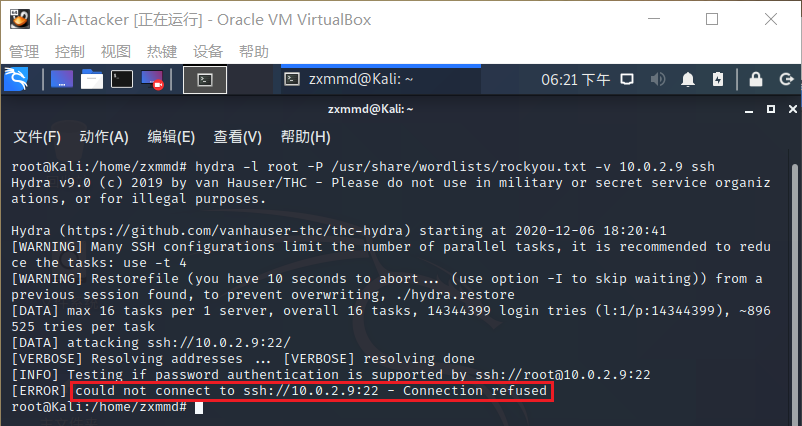

+ 清空刚才设置的规则，恢复实验环境

  ```bash
  fail2ban-client unban all
  ```
  
### 课后思考题

+ 试举⼀例说明“⼈的安全意识和安全能⼒在应用程序安全加固中是不可忽视的重要环节”。

  + 设置的口令为弱口令,如`password`、`123456`

### 实验参考资料

+ [师姐作业](https://github.com/CUCCS/2018-NS-Public-jckling/blob/ns-0x10/ns-0x10/chap0x10实验.md)
+ [课本第十章](https://c4pr1c3.github.io/cuc-ns/chap0x10/main.html)

