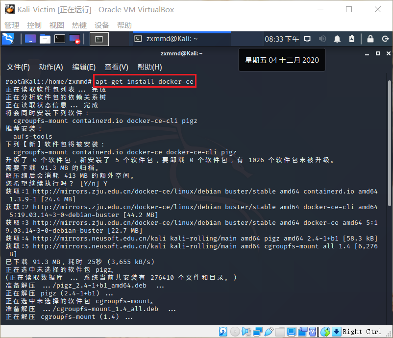

## 常见蜜罐体验和探索

### 实验目的

- 了解蜜罐的分类和基本原理
- 了解不同类型蜜罐的适用场合
- 掌握常见蜜罐的搭建和使用

### 实验环境

- 从paralax/awesome-honeypots中选择 1 种低交互蜜罐和 1 种中等交互蜜罐进行搭建实验
  
  - 推荐 `SSH` 蜜罐
  
- 两台Kali系统虚拟机
   - Attacker : 10.0.2.7
   - Victim : 10.0.2.8 (重装了一次变成了10.0.2.9 , 忘记备份了。。。)

### 实验要求

- [x] 记录蜜罐的详细搭建过程；
- [x] 使用 `nmap` 扫描搭建好的蜜罐并分析扫描结果，同时分析「 `nmap` 扫描期间」蜜罐上记录得到的信息；
- [x] 如何辨别当前目标是一个「蜜罐」？以自己搭建的蜜罐为例进行说明；
- [x] （可选）总结常见的蜜罐识别和检测方法；
- [ ] （可选）尝试基于 [canarytokens](https://github.com/thinkst/canarytokens) 搭建蜜罐实验环境进行自由探索型实验；


### 实验过程

+ 在`Victim`中搭建蜜罐，`Attacker`中模仿攻击者去攻击`Victim`

#### ssh-Honeypot

+ 这是一种低交互式的简易蜜罐

+ 在`Victim`中安装docker

+ 添加docker-ce的apt 源

  ```bash
  apt-get update
  apt-get install -y apt-transport-https ca-certificates curl software-properties-common
  ```

  

+ 添加docker需要的密钥

  ```bash
  curl -fsSL https://download.docker.com/linux/debian/gpg | sudo apt-key add -
  ```

  

+ 安装docker-ce

  ```bash
  apt-get install docker-ce #安装docker
  ```
  
  
  
+ 开启docker服务并测试是否安装成功

  ```bash
  systemctl start docker

  docker run hello-world
  ```

  

+ 使用`docker image`指令查看镜像

  

+ 安装ssh-honeypot，首先安装libssh&libjson-c

  ```bash
  apt install libssh-dev libjson-c-dev
  ```

  

+ 生成公私钥

  ```bash
  ssh-keygen -t rsa -f ./ssh-honeypot.rsa
  ```
  
  
  
+ 安装`docker-ssh-honeypot`

  ```bash
  git clone https://github.com/random-robbie/docker-ssh-honey
  docker build . -t local:ssh-honeypot #构建镜像
  docker run -p 2234:22 local:ssh-honeypot #运行镜像
  docker exec -i -t id bash #进入容器
  tail -F ssh-honeypot.log #查看日志
  ```

  

  
  
+ 通过`docker ps`查看容器的id,才能进入容器

  ```bash
  docker ps

  docker exec -i -t container_id bash #进入容器
  ```

  

+ 查看日志，即可看到攻击者的行为

  ```bash
  tail -F ssh-honeypot.log #查看日志
  ```

+ `Attacker`对蜜罐所在主机进行ssh连接，发现安装蜜罐的主机日志已经把该行为记录下来。但无论输什么密码，连接都会被拒绝，因为ssh-honeypot是一个低交互式的蜜罐，无法完成这些功能。但攻击者的所有行为都被记录下来了，包括输入的密码以及攻击者的ip，达到了蜜罐的初步目标，即收集对方的信息。

  

+ `Attacker`对目标主机进行nmap端口扫描，日志信息中并没有记录下，说明该蜜罐并未对此生效，也再一次说明了该蜜罐的低交互式，只是一个可以简单记录ssh连接的简易蜜罐

  

#### Cowrie

+ Cowrie是一种中到高交互性的SSH和Telnet蜜罐，旨在记录暴力攻击和攻击者执行的shell交互。在中等交互模式（shell）下，它以Python仿真UNIX系统；在高级交互模式（代理）下，它充当SSH和telnet代理，以观察攻击者对另一个系统的行为。

+ 在docker中安装Cowrie

  ```bash
  docker pull cowrie/cowrie
  ```

  

+ 启动cowrie，在端口2222开启，同时在`Attacker`中进行ssh连接，发现已经记录下了所有行为
  
  ```bash
  docker run -p 2222:2222 cowrie/cowrie
  ```
  
  
  
+ 接下来不使用root用户连接，在输入多次密码后被拒绝连接，猜测该蜜罐不允许非root用户连接
  
  
  
+ 对于root用户，输入任意密码都可以登录。由此可见，蜜罐的安全性必须保证，如果攻击者输入的是一段恶意代码，后果很严重。
  
  
  
+ ssh连接会自动断开了，这个反常行为容易被攻击者识别出来
  
  
  
+ 查看一下cowrie的日志文件，可以看到刚刚的`attacker`连接的时间，ip等等信息
  
  ```bash
  docker exec -i -t container_id bash #进入容器

  cd var/log/cowrie/

  cat cowrie.json #查看日志
  ```
  
  
  
+ ssh连接的状态下，进行基本的连通性测试操作，发现`ping`和`curl`指令都正常运行
  
  ```bash
  ping www.baidu.com -c 5

  curl http://www.baidu.com/
  ```
  
  
  
+ 接下来试着执行apt-get指令安装`vim`，再连续多次安装`vim`，发现每次都是新安装的，攻击者有可能就从这里发现蜜罐的存在了。连续的安装得到的回复应该是已安装。
  
  

+ 蜜罐将安装过程记录了下来

  
  
+ 安装的过程也与正常的安装有所不同，下面是正常的安装过程

  

+ 另外，使用`apt install`会报错，只能使用`apt-get install`来安装软件，暴露了自己

  

+ 在蜜罐中只能查看自己创建的目录，也会暴露

  
  
+ 尝试对`Victim`进行nmap扫描，也没有记录下这个信息，扫描的状态结果是开放，而service是`EthernetIp-1`，暴露出了蜜罐的存在。
  
  ```bash
  nmap -sX -p 2222 -n -vv 10.0.2.15
  ```
  
  
  

### 遇到的问题

+ ssh登录蜜罐显示密钥不匹配
  
   + 重启docker后密钥发生改变，使用`ssh-keygen -f "/root/.ssh/known_hosts" -R "[10.0.2.9]:2222"`删除旧密钥并重新添加

  


### 实验总结

+ 蜜罐的识别和检测方法：

  + 从实验中，总结出以下经验

    + 在安装包的时候,蜜罐与真机不同
    + 安装同一个软件，每次都是`1 newly installed`
    + 在进行ssh连接时，任意密码都能登录
    + ssh连接会自动断开
    + 在蜜罐中只能查看自己创建的目录
    + 无法使用`apt install`安装软件


+ 在上述实验中，`ssh-honeypot`是一个低交互式的蜜罐，仅用于记录攻击者的信息，而`cowrie`是一个相对交互式较高、较完善的蜜罐，可以进行ssh远程连接等等一系列“类似真机”的操作


### 参考

+ [师姐作业](https://github.com/CUCCS/2019-NS-Public-chencwx/tree/ns_chap0x11/ns_chapter11)
+ [docker ssh-honeypot](https://github.com/random-robbie/docker-ssh-honey)
+ [安装docker](https://medium.com/@calypso_bronte/installing-docker-in-kali-linux-2018-1-ef3a8ce3648)
+ [docker教程](https://blog.csdn.net/hnytgl/article/details/80576868)


